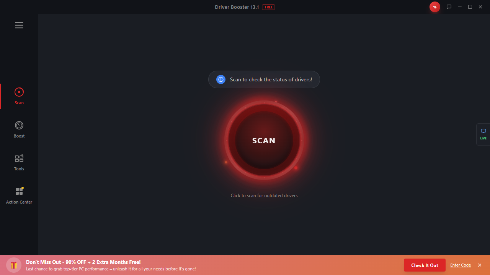

# Perfect Copy




## Overview
Perfect Copy is an Electron desktop application built with React, Vite, TypeScript, and Supabase. It provides a modern desktop experience with system detection, driver management, and real-time data synchronization.

## Features
- Electron desktop shell with native window controls
- Real-time data synchronization via Supabase
- Driver history tracking and management
- Scan page for data inspection
- System detection and information
- Settings and tools pages
- Auto-update mechanism
- Modern UI with shadcn/ui components

## Technology Stack
- **Electron** - Desktop application framework
- **React 18** - UI library
- **Vite** - Build tool and dev server
- **TypeScript** - Type safety
- **Tailwind CSS** - Styling
- **shadcn/ui** - Component library
- **Supabase** - Backend, database, and real-time subscriptions
- **Vitest** - Testing framework

## Project Structure
```text
perfect-copy/
├── electron/
│   ├── main.cjs
│   ├── preload.cjs
│   └── systemInfo.cjs
├── src/
│   ├── components/
│   ├── pages/
│   ├── hooks/
│   ├── lib/
│   └── integrations/
├── supabase/
└── doc/
```

## Getting Started

### Prerequisites
- Node.js 18+
- npm or yarn

### Installation
```bash
git clone <repository-url>
cd perfect-copy
npm install
```

### Development
```bash
npm run dev
```

### Build
```bash
npm run build
npm run build:electron
```

## Screenshots


## License
MIT